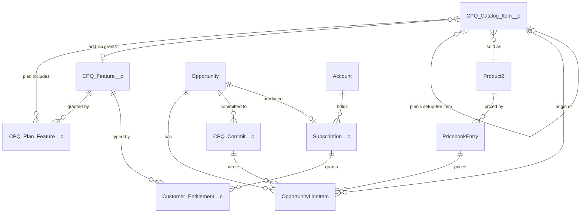

# Custom CPQ on Salesforce — Solution Design

| | |
|---|---|
| **Project** | Headless CPQ: catalog, price-floor enforcement, commit to Opportunity, entitlement automation |
| **Author** | Bruno Romano |
| **Date** | September 2026 |
| **Companion** | Apex prototype + tests (this repository) |

---

## 1. What I'm designing, and the one constraint that shapes it

Reps configure deals in the React/NestJS platform. Salesforce is the catalog of record, the authority that enforces commercial rules, and the origin of durable entitlements. No one opens a Salesforce screen in this workflow.

That produces a single constraint everything else follows from:

> **Salesforce cannot trust the caller.** Every rule below has to hold when the request comes from a script, a Postman tab, or a bug in the platform — not only from the intended UI.

The practical consequences: validation is re-run inside commit and a prior `validate` call is never trusted; the price floor lives in Apex and is never returned as "advisory" data the client is expected to enforce; and the API surface is typed and versioned, because a client I don't control will build against it and I can't redeploy their code.

---

## 2. Scope and assumptions

### 2.1 Assumptions I made

| # | Assumption | Why it matters |
|---|---|---|
| A-1 | **Add-on list prices, floors and charge types are invented.** I used Design Refresh $750 / floor $600 / one-time; Competitor Analysis $150 / floor $120 / recurring; Contacts (500) $100 / floor $80 / recurring. | The brief names the three add-ons but not their commercials. These live in catalog records — RevOps changes them without a deployment. |
| A-2 | Plan prices are monthly recurring; setup fees are one-time; billing frequency is monthly. | Drives the recurring vs. one-time split that billing and entitlements both key off. |
| A-3 | USD only. | Multi-currency would change the catalog to a per-currency price row. Out of scope, but the model isn't blocked from it. |
| A-4 | The Opportunity has an Account before commit. | Entitlements are held against a customer. An Opportunity without an Account cannot produce them, so commit rejects it. |
| A-5 | Permitted contract terms are 12/24/36 months, held as configuration rather than a hard-coded list. | Sales will change this. |
| A-6 | The setup fee is discountable to $0 but never above the catalog amount. | Floor-style rule in the other direction. Flagged below as a question. |
| A-7 | One active Subscription per Account at a time. | Concurrent/overlapping subscriptions are a renewals concern, deliberately out of scope. |
| A-8 | The platform holds its own credentials and passes the rep's identity in the request body. Reps never hold Salesforce credentials. | Without this, no discount is attributable to a person. See §6.3. |

### 2.2 Deliberately out of scope

No UI, no live OAuth handshake, no Opportunity creation, no live callouts to billing or feature gating, no approval workflow, and no use of `Quote`/`QuoteLineItem` — `OpportunityLineItem` is the source of truth for what's being sold, since contracts are generated in PandaDoc. Renewals, amendments, co-terming, proration and cancellation are a later phase; the model is shaped not to preclude them (§9).

### 2.3 Questions I'd take to RevOps and Sales before go-live

| # | Question | Why it's open |
|---|---|---|
| Q-1 | Is uplift above list price permitted, or is there a ceiling as well as a floor? | Currently unbounded. A ceiling is one rule in the same validator. |
| Q-2 | Confirm add-on prices, floors and charge types (A-1). | Data change only, no code impact. |
| Q-3 | Can any rep waive the setup fee to $0, or does the waiver need its own floor or an approval? | Currently freely waivable. This is the discount lever most likely to be abused once the plan floor is enforced. |
| Q-4 | When a contract term ends, who deactivates entitlements — a scheduled Salesforce job, or the gating service reading the end date? | The model supports both (every entitlement carries an active window). The operational owner is undecided. |

---

## 3. Business rules that become code

Only the rules that a test asserts against. Each maps to a test method in §10.

**Catalog**

- **R-1** — Catalog items carry a stable, human-readable code (`PLAN_BRAND`, `ADDON_CONTACTS_500`). Downstream systems key on the code, never on the Salesforce Id.
- **R-2** — Only items active on the configuration's effective date may be quoted.
- **R-3** — Changing a catalog price or floor never retroactively alters committed lines or existing entitlements.

**Configuration**

- **R-4** — Exactly one plan. Zero or multiple is invalid.
- **R-5** — An add-on appears at most once; stacking is expressed as quantity, not repeated lines. Quantity is a positive integer.
- **R-6** — Add-ons that duplicate a plan-included feature are valid in both directions, by design.

**Pricing**

- **R-7** — Negotiated plan price ≥ that plan's floor. Inclusive: exactly at floor passes.
- **R-8** — Each add-on has its own floor; a negotiated price below it fails.
- **R-9** — Setup fee may be discounted to $0 but may not exceed the catalog amount.
- **R-10** — Prices are USD, non-negative, two decimal places.
- **R-11** — Validation returns **every** violation in one response. A rep fixing three lines should make one round trip.

**Contract**

- **R-12** — Effective date required; term must be one of the configured permitted values.

**Commit**

- **R-13** — Commit re-runs full validation server-side. A prior successful validate is never trusted.
- **R-14** — Commit is atomic. All lines and the Opportunity term fields, or nothing.
- **R-15** — Commit is refused if the target Opportunity is already Closed. Closed deals are immutable to this API.
- **R-16** — Re-committing **replaces** the lines this API previously wrote, and leaves lines added by other means untouched.
- **R-17** — Commit is idempotent by key: the same request twice yields one set of lines and returns the original result.

**Entitlements**

- **R-18** — Entitlement quantity per feature is the sum of the plan-included quantity and matching add-on quantities. Binary features do not accumulate; metered features do.
- **R-19** — Only recurring, feature-bearing items produce entitlements. The setup fee and Design Refresh are billable and grant nothing.
- **R-20** — Entitlement creation is idempotent and bulk-safe. A 200-record stage update, or an already-won Opportunity re-saved, creates no duplicates.
- **R-21** — Entitlements are durable: superseded, never silently overwritten.

---

## 4. Data model

### 4.1 ERD



`CPQ_Integration_Log__c` is deliberately standalone — it references the Opportunity and correlation ID by value, not by relationship, so a log survives when the transaction it describes is rolled back (§7.2).

### 4.2 Objects

**`CPQ_Catalog_Item__c`** — everything sellable, in one object. Plans, add-ons and setup fees share a shape: a code, a list price, a floor, an active window and a `Product2`.

| Field | Type | Note |
|---|---|---|
| `Code__c` | Text, External Id, Unique | `PLAN_BRAND`, `ADDON_CONTACTS_500`, `SETUP_BRAND` |
| `Item_Type__c` | Picklist | `Plan` / `Add-On` / `Setup Fee` |
| `List_Price__c`, `Price_Floor__c` | Currency(16,2) | |
| `Charge_Type__c` | Picklist | `Recurring Monthly` / `One-Time` |
| `Product__c` | Lookup(Product2) | Required. See §4.3 |
| `Setup_Fee_Item__c` | Lookup(self) | Plans only → the `Setup Fee` item |
| `Feature__c` | Lookup(`CPQ_Feature__c`) | Add-ons only. **Null for Design Refresh** |
| `Feature_Quantity_Per_Unit__c` | Number | Contacts (500) → `500` |
| `Active__c`, `Effective_Start__c`, `Effective_End__c` | Checkbox, Date, Date | R-2 |

Modelling setup fees as catalog items rather than as a number on the plan means every committed line is uniformly *one catalog item → one `Product2` → one `OpportunityLineItem`*, and RevOps can reprice a setup fee without touching plan records.

**`CPQ_Feature__c`** — the capability catalog, kept separate from the product catalog. Products are what we *sell*; features are what a customer is *entitled to*. Competitor Analysis is both, and conflating them is what makes the overlap case hard.

| Field | Type | Note |
|---|---|---|
| `Code__c` | Text, External Id, Unique | `FEAT_CONTACTS` |
| `Metering_Type__c` | Picklist | `Binary` / `Metered` — the field that decides whether quantities accumulate |
| `Active__c` | Checkbox | |

**`CPQ_Plan_Feature__c`** — junction. Master-detail to the plan, lookup to the feature, plus `Quantity__c`. Plan inclusion carries a quantity (All In → `FEAT_CONTACTS` × 1,000), so it can't be a checkbox.

**`CPQ_Commit__c`** — one row per commit attempt. `Idempotency_Key__c` is a **unique External Id**, which is what makes R-17 real: uniqueness is enforced by the database, so two concurrent identical requests can't both win. Also holds `Correlation_Id__c`, `Acting_Rep__c`, `Opportunity__c`, `Status__c` and `Response_Snapshot__c` (the original response, replayed verbatim on a duplicate key).

`Request_Hash__c` is a SHA-256 of the configuration being sold — plan, prices, add-ons, term — excluding the fields that legitimately differ between a request and its retry. Without it, "same key" and "same request" are indistinguishable, and the 409 in §6.3 for a key reused with a different payload can't be implemented: you'd have to either replay a result for a payload the caller never sent, or silently overwrite. Neither is safe.

**`OpportunityLineItem`** — three custom fields: `CPQ_Catalog_Item__c` (durable link back to the catalog, so Closed Won never re-derives anything by name matching), `CPQ_Charge_Type__c`, and `CPQ_Commit__c`. That last one is how R-16 works: replacing a configuration deletes only lines stamped by a prior commit of this API, and leaves anything a human or another process added alone.

**`Opportunity`** — `Contract_Effective_Date__c`, `Contract_Term_Months__c`, `Contract_End_Date__c` (formula).

**`Subscription__c`** — Account, Opportunity, plan, effective date, term, end date, status. `External_Key__c` (unique External Id, set to the Opportunity Id) is what makes the Closed Won automation idempotent under `upsert`.

**`Customer_Entitlement__c`** — named to avoid colliding with the standard Service Cloud `Entitlement` object, which isn't used here. Master-detail to Subscription, lookup to Feature, plus `Feature_Code__c` (denormalised so downstream never joins), `Quantity__c` (already aggregated), `Metering_Type__c`, `Active_From__c` / `Active_To__c`, and `Status__c` (`Active` / `Superseded`).

**`CPQ_Integration_Log__c`** — §7.

### 4.3 Why `Product2` exists alongside a custom catalog

`OpportunityLineItem` cannot be inserted without a `PricebookEntryId`. That's a platform constraint, not a preference. So each sellable catalog item maps to a `Product2` with a standard `PricebookEntry`.

The division of responsibility is explicit: **`Product2`/`PricebookEntry` is the commercial record the platform requires; `CPQ_Catalog_Item__c` is the source of truth for the CPQ rules** — floors, included features, charge type, effective windows — none of which `Product2` can express. Putting floors in a `PricebookEntry` custom field would have avoided one object, but it would scatter the rule set across a standard object shared with every other sales process in the org.

---

## 5. Entitlement aggregation

The case the brief calls out, plus one that proves the logic isn't hard-coded to two sources.

**Brand ($595/mo, includes Contact pack ×1) + Contacts (500) ×1**

| Feature | From plan | From add-ons | Entitlement |
|---|---|---|---|
| Website hosting | enabled | — | **enabled** |
| Listing feeds | enabled | — | **enabled** |
| Contacts | 500 | 500 | **1,000** |

**All In ($2,495/mo, includes Contact pack ×2) + Contacts (500) ×3 + Competitor Analysis ×1 + Design Refresh ×1**

| Feature | From plan | From add-ons | Entitlement |
|---|---|---|---|
| Website hosting | enabled | — | **enabled** |
| Listing feeds | enabled | — | **enabled** |
| Competitor analysis | enabled | enabled | **enabled** — once, not twice |
| Contacts | 1,000 | 1,500 | **2,500** |
| *Design Refresh* | — | — | **no entitlement** |

Two things fall out of the model rather than out of special-case code:

**Binary vs. metered is a field, not an `if`.** `CPQ_Feature__c.Metering_Type__c` decides whether the reducer sums or ORs. Competitor Analysis arriving from both the plan and an add-on resolves to enabled once because it's `Binary`; contacts accumulate because they're `Metered`. Neither source is privileged — the plan is not "the base" that add-ons top up.

**Design Refresh produces nothing because its `Feature__c` is null.** It's a one-off design service, not a capability to gate. It must reach billing and must never reach feature gating. There is no `if (code == 'ADDON_DESIGN_REFRESH')` anywhere in the code; the absence of a feature link is the whole mechanism, and any future non-entitling add-on works the same way with no deployment.

The algorithm, in one pass and bulk-safe:

1. Query committed `OpportunityLineItem`s for the won Opportunities where `CPQ_Catalog_Item__c != null`.
2. Skip `Setup Fee` and `One-Time` items (R-19).
3. Plan lines → their `CPQ_Plan_Feature__c` rows, contributing `Quantity__c`.
4. Add-on lines → their catalog item's `Feature__c`, contributing `Feature_Quantity_Per_Unit__c × OLI.Quantity`.
5. Reduce into `Map<Id oppId, Map<Id featureId, Decimal>>`, summing where metered and taking presence where binary.
6. Upsert one `Subscription__c` per Opportunity by external key, then insert its entitlements.

Two SOQL queries and two DML statements regardless of batch size.

One qualification, because it's the kind of claim that quietly stops being true. Regenerating over a subscription that already exists has to find the previous entitlements and supersede them, which costs one more query and one more DML. That path is entered only when the upsert reports the subscription already existed — so the two-and-two above holds for every normal close, and the extra pair is paid only when there is genuinely prior history to preserve.

---

## 6. Integration surface

### 6.1 Why custom Apex REST

| Option | Verdict |
|---|---|
| **Custom Apex REST** (`@RestResource`) | **Chosen.** The caller is a NestJS service speaking HTTP. Typed request/response shapes, explicit status codes, an explicitly versioned URI, and — the deciding factor — the business rules run inside the endpoint where the client cannot route around them. |
| Standard sObject REST + Composite | Rejected. The platform would assemble line items itself, which means pricing rules live in the client. That is precisely the failure mode this project exists to prevent. |
| Invocable Apex | Rejected. Designed for Flow. Calling it externally via the Actions API gives an awkward wrapper, weaker typing and no natural place for HTTP semantics. |
| GraphQL / UI API | Rejected. No hook for server-side commercial rules. |

Outbound (Salesforce → platform) is intentionally *not* solved with callouts in this phase; see §6.5.

### 6.2 Endpoints

```
GET  /services/apexrest/cpq/v1/catalog?effectiveDate=2026-09-07
POST /services/apexrest/cpq/v1/configurations/validate
POST /services/apexrest/cpq/v1/opportunities/{opportunityId}/commit
```

**`GET /catalog`** returns plans (with list price, floor, setup fee, included features and quantities) and add-ons (with list price, floor, charge type and mapped feature), filtered to items active on the requested date, defaulting to today. Every item carries its code so the platform never stores Salesforce Ids. The response includes `catalogVersion` — the max `SystemModstamp` across catalog objects — so the platform can cache and cheaply detect staleness.

**`POST /validate`** takes a proposed configuration and returns:

```jsonc
{
  "correlationId": "b3f1…",
  "valid": false,
  "violations": [
    { "code": "PLAN_BELOW_FLOOR",  "line": "PLAN_BRAND",
      "submitted": 425.00, "permitted": 450.00,
      "message": "Brand plan price is below the $450.00 floor." },
    { "code": "ADDON_BELOW_FLOOR", "line": "ADDON_CONTACTS_500",
      "submitted": 70.00,  "permitted": 80.00,
      "message": "Contacts (500) price is below the $80.00 floor." }
  ],
  "totals": null
}
```

Structured, not prose — the platform renders its own field-level errors from `line` and `code`. All violations in one response (R-11). No DML, no side effects, safe to call on every keystroke.

**`POST /commit`** takes the finalised configuration plus an `idempotencyKey`, re-validates from scratch, and writes the plan line, the setup-fee line, the add-on lines and the Opportunity contract fields inside one savepoint. It returns the Opportunity Id, the created line Ids, computed totals (monthly recurring, one-time, first invoice, total contract value) and the correlation ID.

### 6.3 Status codes, and one deliberate asymmetry

| Status | Meaning |
|---|---|
| `200` | Success. **Including a `validate` call that returns `valid: false`** |
| `422` | Commit refused on business-rule violations — same payload shape as `validate` |
| `400` | Malformed request: bad JSON, missing field, wrong type, unparseable Id |
| `404` | Opportunity not found **or not accessible** — deliberately indistinguishable, so the endpoint can't be used to probe which Ids exist |
| `409` | Opportunity already Closed, or an idempotency key replayed with a different payload |
| `403` | The integration principal lacks required object or field access |
| `500` | Unexpected — typed error and correlation ID to the caller, stack trace to the log only |

The asymmetry is intentional: `validate` asks *"is this valid?"*, and answering "no" is a successful call, so it's `200`. `commit` asks *"write this"*, and refusing is a failed action, so it's `422`. Stating it here because a client developer will otherwise guess, and guess differently.

Violation codes are a closed, documented set — `PLAN_BELOW_FLOOR`, `ADDON_BELOW_FLOOR`, `SETUP_FEE_ABOVE_CATALOG`, `PLAN_MISSING`, `PLAN_MULTIPLE`, `ADDON_DUPLICATE`, `ADDON_QUANTITY_INVALID`, `UNKNOWN_CATALOG_CODE`, `INACTIVE_CATALOG_ITEM`, `INVALID_CONTRACT_TERM`, `EFFECTIVE_DATE_MISSING`, `NEGATIVE_PRICE`, `PRICE_PRECISION_INVALID` — so the platform can branch on them and localise its own messages. Codes are additive across versions; removing or repurposing one is a breaking change and gets `/v2`.

### 6.4 Authentication, and where the rep's identity actually goes

**Pattern:** a Connected App using the **OAuth 2.0 client credentials flow**, server-to-server, no user interaction, no refresh-token lifecycle for the platform to manage. It runs as a named integration user, `svc_revtech_cpq`, provisioned on a **Salesforce Integration license** — API-only, cannot log into the UI, and materially cheaper than a full seat. JWT bearer with a certificate is the alternative if RevTech prefers certificate rotation over secret rotation; both terminate at the same integration user, so the choice doesn't affect the design.

That user gets one permission set, `CPQ_Integration_User`: read on the catalog objects, create/read/edit on the three it actually writes (`CPQ_Commit__c`, `Subscription__c`, `Customer_Entitlement__c`), read on `Product2`/`PricebookEntry`, read/write on `Opportunity` and `OpportunityLineItem`, and Apex class access to the three endpoints. No "Modify All Data", no "View All".

A second permission set, `CPQ_Catalog_Admin`, carries RevOps' write access to the catalog — plans, prices, floors, included features. Splitting them is the point: the principal that *sells* against the floor is not the principal that can *change* the floor, so a compromised integration credential cannot quietly reprice the catalog and then sell under it.

**The rep is not the authenticated principal, and this matters.** Salesforce sees one integration user for every rep in the company. So the platform passes `actingRepEmail` in the request body; Salesforce resolves it to an active `User`, rejects it if it doesn't resolve, and stamps it on `CPQ_Commit__c` and on every log row.

To be explicit about what that identity is and isn't: **it is attribution, not authorisation.** Access is still governed entirely by the integration user's permissions and sharing. Treating a client-supplied identity as an authorisation claim would let anyone holding the integration credentials act as anyone. But without capturing it, no discount is traceable to a person, and "who sold this at the floor?" becomes unanswerable — which is half the reason for enforcing floors at all.

### 6.5 Keeping data in sync

**Catalog (Salesforce → platform):** pull with caching. The platform calls `GET /catalog` on boot and on an interval, keyed on `catalogVersion`. The catalog changes a few times a quarter and staleness is low-risk — a stale floor in the client's UI is caught by the server-side check at commit, which is exactly why that check exists. A `CPQ_Catalog_Changed__e` platform event can push invalidation later; it's an optimisation, not a correctness requirement.

**Entitlements (Salesforce → downstream):** the model is shaped so this becomes a *publish*, not a redesign. Because entitlements are already resolved rows with a code, a quantity and an active window, emitting `Customer_Entitlement_Changed__e` on insert is a small addition. Billing is better served by Change Data Capture on `OpportunityLineItem` and `Subscription__c`, or a scheduled pull keyed on the external Id.

**Why no callouts from the Closed Won trigger:** a callout would make the sales rep's stage change depend on the availability of two other systems. If billing is down, the deal doesn't close. Events decouple that, and a lost event is recoverable by replay in a way that a failed synchronous callout inside a rolled-back transaction is not.

---

## 7. Security on an externally-callable surface

### 7.1 Enforcement

- **Sharing is declared, never inherited.** Apex REST classes run in system context unless told otherwise, so each endpoint class is explicitly `with sharing`. The integration user's record access then genuinely applies.
- **CRUD/FLS enforced by the platform, not by hand.** All queries use `WITH USER_MODE`, and DML runs as `Database.insert(records, AccessLevel.USER_MODE)`. Hand-rolled `isAccessible()` checks drift the moment a field is added; user-mode enforcement doesn't. `Security.stripInaccessible` shapes any response assembled from records the caller may only partly read.
- **No dynamic SOQL.** Every query is static with bind variables. Where a filter is genuinely dynamic (the catalog's effective-date window), the value is bound, never concatenated. If dynamic SOQL is ever unavoidable, field and object names come from an allow-list, not from the request.
- **Ids are validated before use.** The path parameter goes through `Id.valueOf` inside a try/catch and is checked to be of type `Opportunity` before any query. A malformed Id is a clean `400`, not an unhandled `StringException` returned to the caller.
- **Not found and not permitted return the same `404`.** Distinguishing them turns the endpoint into an Id oracle.
- **Errors never leak internals.** The caller gets a typed code, a safe message and the correlation ID. The stack trace goes to the log.
- **Input is bounded.** Line counts, string lengths and numeric precision are validated before anything is queried, so a hostile payload can't burn governor limits on its way to being rejected.

**One consequence worth stating, because it bit the build.** Fields deployed through the Metadata API carry no field-level security for any profile — including System Administrator. Combined with user-mode enforcement everywhere, that means a freshly deployed org is not merely restricted but inert: even an admin can't see `Active__c`, and the Apex won't compile against fields it has no access to. The permission sets are therefore part of the deployable artifact, not a post-install click path, and assigning one is a required step in the README rather than a footnote.

That is the correct failure mode. A system whose security defaults to open is one bad deployment away from an unprotected floor; this one defaults to closed and makes you say who gets in.

### 7.2 Logging and monitoring

`CPQ_Integration_Log__c` records, per call: correlation ID, endpoint, acting rep, integration user, target Opportunity, outcome, violation codes, duration and timestamp. Queryable by correlation ID, Opportunity, rep or date range, so support answers "what happened to this deal?" in one query.

**The non-obvious part:** a commit that fails rolls back to its savepoint — and a log record inserted in that transaction rolls back with it, so the failures you most want to see are exactly the ones that erase themselves. Logs are therefore published as `CPQ_Log_Event__e` platform events with `PublishBehavior = PublishImmediately`, which commits independently of the enclosing transaction. A trigger on the event writes the log row.

Validation failures are logged with their violation codes deliberately: sub-floor attempts are commercially interesting — the distribution of how far below floor reps are trying to go is the input to the next pricing conversation, and to Q-3.

**Monitoring:** the log object feeds a report on error rate, commit volume and top failure reasons, with a dashboard and a reporting snapshot for trend. A sustained error rate above threshold raises an alert. In production I'd forward the events to the same observability stack Engineering already uses for the NestJS platform rather than build a second one inside Salesforce — one correlation ID spanning both sides is worth more than two good dashboards that don't join. Retention is bounded by a scheduled purge, since an unbounded log object eventually becomes a storage problem and a slow report.

---

## 8. Closed Won automation

A single `after update` trigger on Opportunity delegating to a handler class. It fires only on the **transition into** Closed Won — `oldMap` stage is not Closed Won, new record `IsWon` — so re-saving a won Opportunity does nothing, and an edit to a long-closed deal doesn't regenerate entitlements.

Idempotency is enforced twice over: by that transition check, and structurally by `Subscription__c.External_Key__c` being a unique External Id upserted on the Opportunity Id. The transition check handles the common case; the unique key is what holds if a future entry point bypasses the trigger.

Bulk safety: queries and DML are outside all loops, two SOQL and two DML regardless of batch size (with the one qualification in §5.1), correct for a 200-record `Data Loader` stage update. The test asserts the limit consumption directly rather than just the record counts, because a per-record query is the kind of regression that passes a correctness test and fails in production at row 201.

**Failure handling.** Entitlements are created synchronously in the trigger, so the subscription, the entitlements and the won stage commit together or not at all — a deal cannot be won with half-built entitlements. On failure the handler calls `addError` on that specific Opportunity, which fails that record only and lets the other 199 in the batch succeed, and publishes a log event that survives the rollback. It does not swallow the exception.

This is the right trade-off at current volume. If entitlement creation later needs a callout, it moves to a Queueable chained from the trigger and the guarantee weakens from transactional to eventually-consistent — which is worth doing deliberately, not by accident.

---

## 9. What this phase deliberately doesn't do

Renewals, amendments, co-terming, proration and cancellation are the obvious next phase, and the model is shaped so they're additions rather than a rewrite: entitlements already carry an active window and a `Superseded` status rather than being updated in place, subscriptions already carry term and end date, and committed lines already retain their catalog origin. An amendment becomes a new subscription superseding the old with a new entitlement generation, and the history of what a customer was entitled to *at a point in time* survives — which is what a billing dispute six months later actually needs.

Approval routing for sub-floor pricing is out of scope by instruction, but it's the most likely first change request once reps hit the floor. Because validation returns structured violations rather than throwing, routing a `PLAN_BELOW_FLOOR` to an approval path is a branch in the platform, not a redesign here.

---

## 10. Test strategy

Acceptance criteria are expressed as test methods rather than as a document section, so traceability is executable.

| Test method | Asserts |
|---|---|
| `catalog_returnsActivePlansAndAddOnsWithCodes` | R-1, R-2 |
| `catalog_effectiveDateExcludesExpiredItems` | R-2 |
| `validate_planPriceExactlyAtFloor_passes` | R-7, inclusive boundary |
| `validate_planPriceOneCentBelowFloor_fails` | R-7 |
| `validate_subFloorPlanAndSubFloorAddOn_returnsBothViolations` | R-11 |
| `validate_setupFeeAboveCatalogAmount_fails` | R-9 |
| `validate_setupFeeWaivedToZero_passes` | R-9 |
| `validate_duplicateAddOnLine_fails` | R-5 |
| `validate_zeroPlansAndTwoPlans_fail` | R-4 |
| `validate_unknownAndInactiveCodes_returnDistinctViolationCodes` | R-2 |
| `validate_performsNoDml` | no side effects |
| `commit_validConfiguration_createsPlanSetupFeeAndAddOnLines` | R-14 |
| `commit_subFloorSkippingValidate_createsNothing` | R-13, R-14 |
| `commit_secondCommit_replacesPriorCpqLinesOnly` | R-16 |
| `commit_manuallyAddedLine_survivesRecommit` | R-16 |
| `commit_sameIdempotencyKeyTwice_createsOneSetAndReplaysResult` | R-17 |
| `commit_closedOpportunity_rejectedWith409` | R-15 |
| `commit_malformedOpportunityId_returns400NotException` | typed errors |
| `closedWon_brandPlusContacts500_entitlesOneThousandContacts` | R-18 |
| `closedWon_allInWithCompetitorAnalysisAddOn_entitlesOnceNotTwice` | R-18, binary |
| `closedWon_designRefresh_billableWithNoEntitlement` | R-19 |
| `closedWon_setupFee_producesNoEntitlement` | R-19 |
| `closedWon_bulk200Opportunities_withinGovernorLimits` | R-20 |
| `closedWon_alreadyWonOpportunityResaved_createsNothing` | R-20 |
| `closedWon_catalogPriceChangedAfterCommit_entitlementUnaffected` | R-3, R-21 |

Coverage is evidence that the logic is tested, not a number to hit: the boundary cases (exactly at floor, one cent below), the negative paths and the 200-record bulk case are the ones that matter.

**As built: 66 tests, all passing, 89% org-wide coverage.** The table above is the core set that maps to a rule; the remainder cover the REST layer's status codes and error envelopes, the logging that survives a rollback, and the failure paths — including the one where a single bad record in a batch of a hundred fails alone and the other ninety-nine still close.

`scripts/demo.sh` runs the whole path over HTTP against a real org: catalog, a refusal at $425, a pass at exactly $450, a refused commit that writes nothing, an accepted commit, a retried commit that replays rather than double-writing, then Closed Won and the resulting entitlements. It is the fastest way to see the design behave without reading any of it.

```bash
sf org login web -a luxurycpq -s
sf project deploy start -d force-app
sf org assign permset -n CPQ_Integration_User -n CPQ_Catalog_Admin   # required, see §7.1
sf apex run --file scripts/apex/seed-catalog.apex
sf apex run test --test-level RunLocalTests --code-coverage
./scripts/demo.sh luxurycpq
```

---

## Appendix — Catalog reference data

**Plans**

| Plan | Code | List (monthly) | Floor | Setup fee |
|---|---|---|---|---|
| Launch | `PLAN_LAUNCH` | $295.00 | $250.00 | $500.00 |
| Brand | `PLAN_BRAND` | $595.00 | $450.00 | $1,000.00 |
| All In | `PLAN_ALL_IN` | $2,495.00 | $2,000.00 | $2,500.00 |

**Features**

| Feature | Code | Metering | Launch | Brand | All In |
|---|---|---|---|---|---|
| Website hosting | `FEAT_WEBSITE_HOSTING` | Binary | ✔ | ✔ | ✔ |
| Listing feeds | `FEAT_LISTING_FEEDS` | Binary | ✔ | ✔ | ✔ |
| Competitor analysis | `FEAT_COMPETITOR_ANALYSIS` | Binary | — | — | ✔ |
| Contacts | `FEAT_CONTACTS` | Metered | — | 500 | 1,000 |

**Add-ons** — prices and floors per assumption A-1, pending RevOps confirmation (Q-2).

| Add-on | Code | Feature granted | Charge type | List | Floor |
|---|---|---|---|---|---|
| Design Refresh | `ADDON_DESIGN_REFRESH` | *none* | One-time | $750.00 | $600.00 |
| Competitor Analysis | `ADDON_COMPETITOR_ANALYSIS` | `FEAT_COMPETITOR_ANALYSIS` | Recurring | $150.00 | $120.00 |
| Contacts (500) | `ADDON_CONTACTS_500` | `FEAT_CONTACTS` × 500 | Recurring | $100.00 | $80.00 |